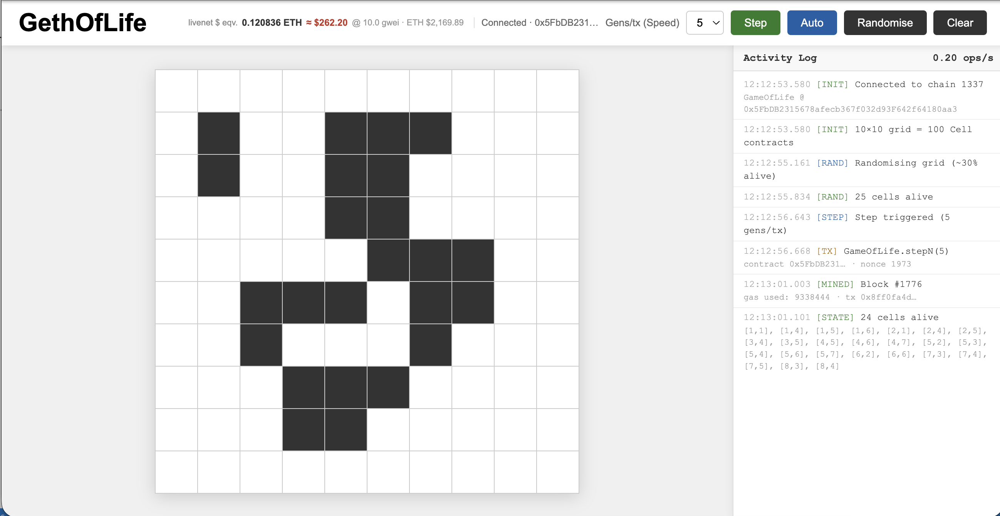

# `GethOfLife`

Conway's Game of Life implemented on an Ethereum testnet: each cell is a deployed Solidity contract.



## How it works

- Click any cell to toggle it alive/dead (sends a transaction to that `Cell` contract)
- **Gens/tx** - configuration of operations to multiplex in each tx (speed of simulation, cost)
- **Step** - advances all cells one generation using Conway's rules (calls `GameOfLife.step()`)
- **Auto** - steps automatically every 3 seconds
- **Clear** - kills all cells

This deploys a `GameOfLife` contract and a 10x10 grid of `Cell` contracts, wires up their Moore neighbourhoods, and writes `deployed.json`.

A simulated Gas cost is provided for demonstration of how prohibitively expensive this would be.

## Running via Docker

```bash
docker pull ghcr.io/psedge/GethOfLife:latest
docker run -p 3000:3000 ghcr.io/psedge/GethOfLife:latest
```

Then open `http://localhost:3000` in your browser.

## Running locally

**Prerequisites:** Node.js, npm

```bash
npm install
```

**Terminal 1: start a local Hardhat node:**
```bash
npm run node
```

**Terminal 2: deploy contracts:**
```bash
npm run deploy
```

**Terminal 2: serve the frontend:**
```bash
npm run serve
```

Then open `http://localhost:3000` in your browser.

## Project structure

```
contracts/
  Cell.sol        # Individual cell contract with GoL step logic
  GameOfLife.sol  # Manager: holds cell registry, orchestrates step()
scripts/
  deploy.js       # Hardhat deploy script
index.html        # Frontend (ethers.js, no build step)
hardhat.config.js
```
